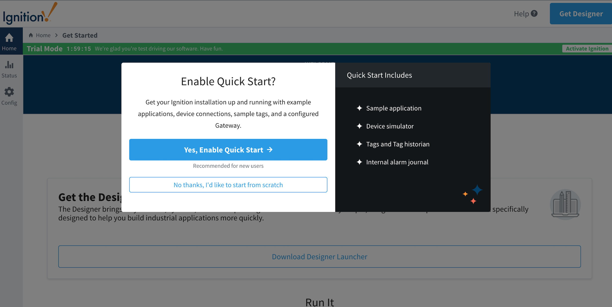
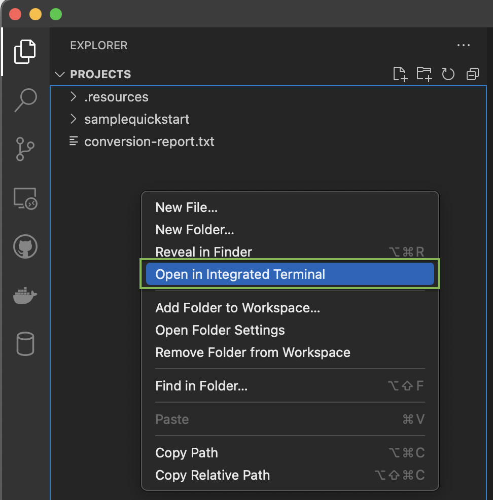
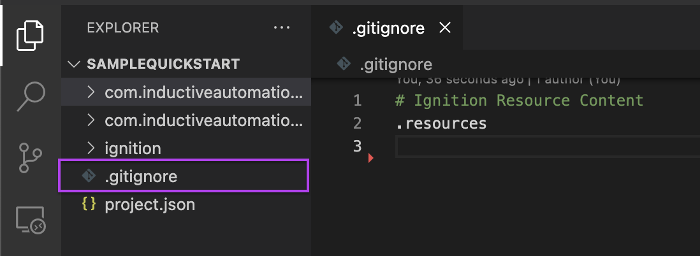
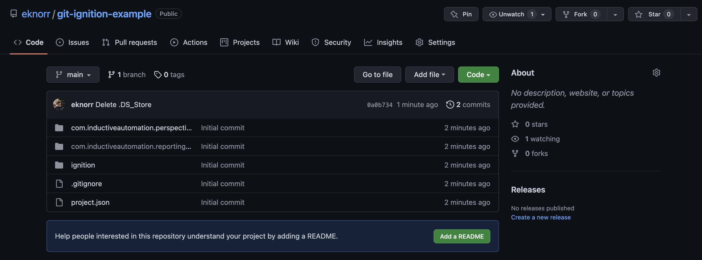
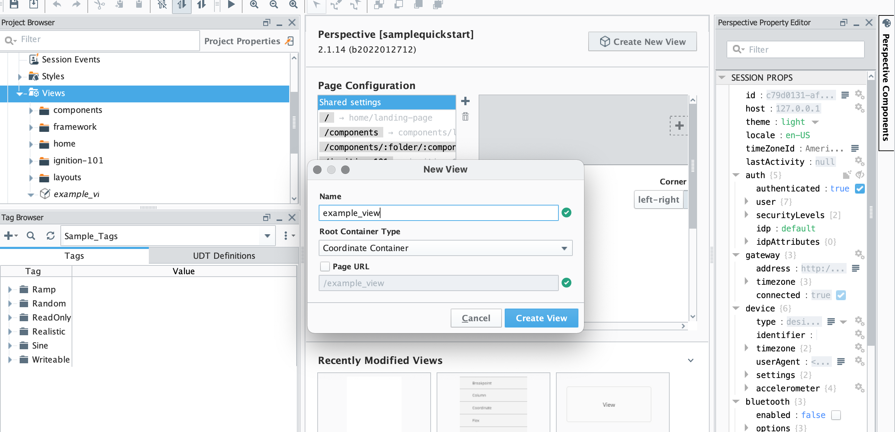
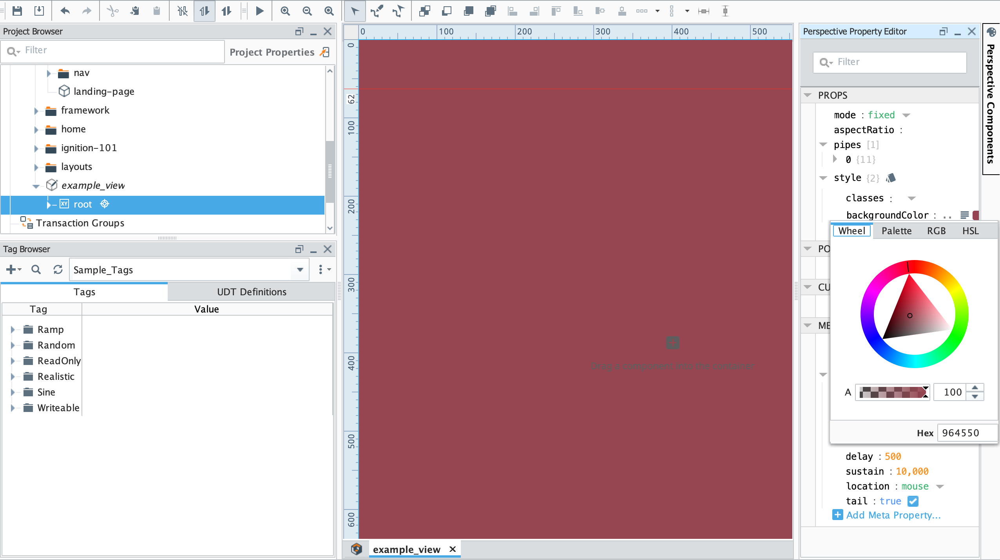
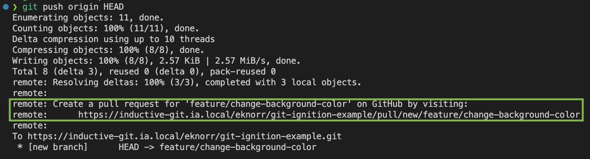
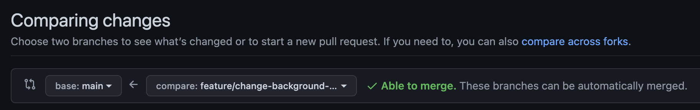
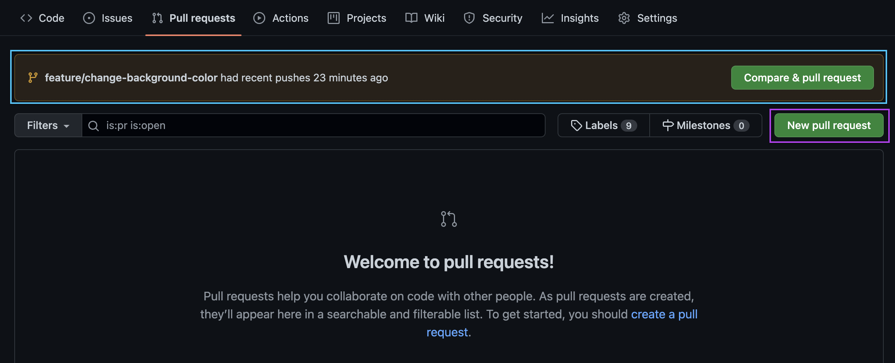
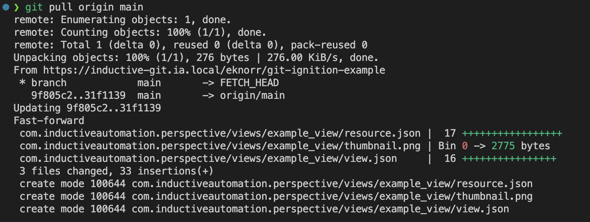

# Ignition Example

## Table of Contents

- [Ignition Example](#ignition-example)
  - [Table of Contents](#table-of-contents)
  - [Purpose](#purpose)
  - [Before Getting Started](#before-getting-started)
    - [Required](#required)
  - [Procedure](#procedure)
    - [Set up the Ignition Gateway](#set-up-the-ignition-gateway)
    - [Initialize Repository](#initialize-repository)
      - [Open the project on Visual Studio Code](#open-the-project-on-visual-studio-code)
      - [Log in to Github](#log-in-to-github)
      - [Add .gitignore file](#add-gitignore-file)
      - [Create a remote repository](#create-a-remote-repository)
      - [Initialize the local repository](#initialize-the-local-repository)
    - [Develop a New Feature](#develop-a-new-feature)
    - [Submit a Pull Request](#submit-a-pull-request)
    - [Updating your local repository](#updating-your-local-repository)
  - [Common Errors](#common-errors)
  - [Additional Resources](#additional-resources)

## Purpose

This is a _Getting Started_ tutorial intended for those who are new or newer to Git version control with Ignition. By the end of this tutorial, you should have a basic understanding of how to set up Git with Ignition and the workflow to start tracking your codebase with Git. This is written like a lab, so follow along on your own and use the [Ignition Version Control Guide](https://github.com/ia-eknorr/ignition-version-control) or other internet resources as necessary.

## Before Getting Started

  In order to perform version control on Ignition, ensure the following are properly set up or installed:

### Required

- [Proper workstation setup](https://github.com/ia-eknorr/ignition-version-control/blob/main/Workstation%20Setup.md)
  - Git
  - Github CLI
  - Visual Studio Code
- [Ignition](https://inductiveautomation.com/downloads/)
  - Either in a Docker container or installed on host

## Procedure

The goal of this exercise is to focus on version control and how it works with Ignition. The Ignition Quick Start project will be used as a starting place so there is something to add to a repository and version control. It is good to note that while this guide is used with Quick Start, the procedure is the same with a project where Quick Start isn't used. All references to the Quick Start project can be replaced with your project name.

---

### Set up the Ignition Gateway

1. Commission and start the Ignition Gateway
2. After commissioning, select "Yes, Enable Quick Start"
   1. Naturally, this is not required for all implementations
   2. [Here](https://docs.inductiveautomation.com/display/DOC81/Quick+Start+Guide) is a guide to the Ignition Quick Start if needed



---

### Initialize Repository

#### Open the project on Visual Studio Code

1. Open VS Code and navigate to the project directory
   1. Select `File/Open Folder...` and open the Ignition project located in the `data/projects` folder.
      1. Ex: `<ignition-install-path>/data/projects/quickstart`
2. In the VS Code `EXPLORER` tab, right click the project and select `Open in Integrated Terminal`

   1. Within the terminal, verify you are in the correct directory by typing the command `pwd` (`P`rint `W`orking `D`irectory). This directory should be within the project name, `samplequickstart`.
      - For Mac the directory should be: `/usr/local/ignition/data/projects/samplequickstart`
      - For Windows the directory should be: `C:\Program Files\Inductive Automation\Ignition\data\projects\samplequickstart`

#### Log in to Github

Login to Github with the integrated terminal by running the following commands:

```shell
git config --global user.name "YourUserName"

git config --global user.email "your@email.addr"
```

#### Add .gitignore file

1. At the top level of your directory, create and save a file named `.gitignore` with the following code:

    ```python
    # Ignition Resource Content
    .resources
    ```

    
   - This will ignore all of Ignition's resource files, which frequently change and do not need to be version controlled

> :bulb: **_FAQ_**: What if I was blocked from creating a new file in my repository?
>
> This can happen for several reasons, and it usually depends on the exact error that git gives you when trying to create the file. Typically, running VSCode as Administrator solves this issue (if on Windows - this issue has not been seen on Macs).

> :memo: **_Note_**: .gitignore files are very useful - it specifies intentionally untracked files that Git should ignore. These files will still exist on the gateway, and will not be removed, just will not be version controlled.
>
> Although this example is Ignition specific, it is also possible to ignore any other type of file that shouldn't be tracked. You may want to also exclude:
>
> - `com.inductiveautomation.vision/`: if your project does not use vision, it is not needed.
> - `DS_Store`: if using a Mac, the `DS_Store` file contains your viewing preferences.
> - `*.code-workspace`: This will ignore your workspace files if using VS Code.
> - `.vscode/`: if using VS Code, this will ignore files created by VS Code.
> - `__pycache__/`, `.jython_cache`  and `.pytest_cache`: can be used to ignore caches made by python, jython and pytest.
> - `*.pyc`: will ignore the compiled byte code python files.

#### Create a remote repository

1. In the upper-right corner of any page on the GitHub web browser, use the  drop-down menu, and select New repository
2. Type a short, descriptive name for the new repository.
   1. See the [IA Git Style Guide](https://github.com/ia-eknorr/ignition-git-style-guide) for help naming your repo
3. Select the "Create repository"

#### Initialize the local repository

1. Run the following commands in the integrated terminal:

    ```shell
    git init .
    git remote add origin <Your version control repository link>
    git add .
    git commit -m "Initial commit"
    git push -u origin main
    ```

2. About the commands:

- `git init`:
  - `init` initializes the repository.
- `git remote add origin <Repository Link>`:
  - `remote add` refers to adding a location where the work is stored. In this case, it is held remotely on GitHub.
  - `origin` is an alias for a particular repository. In this case, the link you have added.
  - `<Repository Link>` is the repository which will be herein referred to as `origin`. The link to your repository is a combination of the github url, your username (or the organization the repo is made under), and the name of your repository. In the example, the url is: `https://github.com/ia-eknorr/ignition-version-control.git`.
- `git add .`:
  - `add .` adds the work you have done in the current directory to the staging area. Because the repository has no previous commits, this will be many Ignition files. The `.` is used to chose all changed files of the directory you are working in.
- `git commit -m "Initial commit"`:
  - `commit` is the command for committing your work. A commit is good to do regularly, it allows for going back to the exact state of your work at the time of the commit.
  - `-m "Initial commit"` adds a message to the commit. In this case, the message is "Initial commit". It is important to be specific when writing the messages as it becomes difficult to remember what each commit was for and can be confusing if there was ever a need to rollback to a specific commit.
  - Without the `-m` it will open a text editor with a file that you can type the message into.
- `git push -u origin main` allows for pushing all of the commits to the remote main.
  - `-u` links a local branch to a remote branch for subsequent push/pull commands. The local branch you push is automatically linked with the remote branch. In this case, whenever you `git push` or `git pull` after this first command, git knows the upstream branch to your local `main` branch is `origin/main`.
  - After the first time pushing to a branch, the `-u` flag is not needed, and pushing new code can be accomplished by `git push`.

You have just made and initialized a GitHub repository. To verify, you can go to your GitHub account and see the new repository. Below is an example



---

### Develop a New Feature

Now that your repository has been initialized, it's time to add a new feature.

1. Create a new branch by running the following command in the integrated terminal
   > `git checkout -b feature/change-background-color`.
     - The `checkout` command allows for navigating to a branch. This command can also be used switching to another branch. For example, to get to the main branch the command is `git checkout main`.
     - The `-b` stands for branch. This creates the new branch.
     - `feature/change-background-color` is the name of your branch.
       - The [IA Git Style Guide](https://github.com/ia-eknorr/ignition-git-style-guide#branches-1) has a section on branching naming convention that can be used in the future.

2. Open the Ignition Designer and make a new view called `example_view`.
  

3. Edit the background color, for this example the background has been changed to red.
  
4. Once your new feature has been added, save in the Ignition Designer and return to your terminal.
5. In the integrated terminal, run `git status` to show you the status of all your work within the branch.

- This should show that several files have been modified, specifically in `com.inductiveautomation.perspective`.


  > :bulb: **_FAQ_**: What if `git status` shows modified files I didn't actually edit?
  >
  > This can happen for several reasons, a couple common problems are listed here:
  >
  > 1. When a view or script is opened in the Ignition designer, the `resource.json` file for that view or script can be automatically updated by Ignition, even if no changes were made.
  >     - Solution: If you don't need these changes, you can run the following commands to "stash" these changes and remove them from the working tree.
  >       - `git stash push path/to/file`
  >       - If multiple files within the same directory need to be stashed, you can use `git stash push path/to/parent/*`, which will stash all modified files in that parent directory.
  > 2. You may have actually made changes to those files, and they belong in this feature.
  >     - Solution: Add the unexpectedly modified files to either this commit or to another commit if it belongs to another part of the same feature.
  >       - `git add path/to/unexpected/file && git commit -m "I need these changes, but they don't belong to the other part of my feature"`
  >       - `git add . && git commit -m "I included all my changes, even the ones I didn't expect"`

6. Add and commit the new feature to the local repository by running the following commands:

    > git add .
    >
    > git commit -m "Feature: Changed background color"

    - Recall that `git add .` adds _all_ changes found in `git status` to the staging area to be committed.
    - This is the `commit` command that was done earlier, but now to commit the new feature.

7. Push the new feature from to the remote repository
    > `git push -u origin HEAD`
    - `-u` sets the remote repository's version of the branch as the upstream of the branch. This means that when pushing code to the same branch in the future, only `git push` is needed because git already knows where to push to.
    - `HEAD` is the current branch. This command in full is to push to the remote branch, `feature/change-background-color`.
    - You should see in the terminal a new branch was created.
      

> :memo: **_Note_**: In this example, `HEAD` was used as a shortcut to reference the current branch name. Note that the command `git push origin feature/change-background-color` would have had the same effect. Often, it is simpler to use head to refer to the branch you are on instead of trying to remember what the branch was called or making sure it was keyed correctly.

> :memo: **_Note_**: You should be pushing to your remote branch anytime you are done working on the branch, whether you are going to work on a different branch or are done working for the day. This allows other people to pick up where you left off without the chance of doubling up on work.

---

### Submit a Pull Request

Pull requests (PRs) let you tell others about changes you've pushed to a branch in a repository on GitHub. Once a pull request is opened, you can discuss and review the potential changes with collaborators and add follow-up commits before your changes are merged into the base branch.

1. There are several ways to easily create a new PR. Choose any method you'd like:
   - After pushing changes from the integrated terminal, you can find a link that will take you directly to the Pull Request page with the correct branch selected and title pre-filled.
    
   - On the GitHub webpage, navigate to the `Pull requests` tab of your remote repository. The orange banner will have a shortcut to open a PR for recently pushed changes (shown with blue outline below). Click on the green button to "Compare and pull request" to create.
   - Manually create a Pull Request
      - On the GitHub webpage, navigate to the `Pull requests` tab of your remote repository.
      - Select `New pull request` (Shown in pink below)
      - Select the branch you want to add your code to. This is usually the main branch. Then select the name of your branch. You should see an arrow pointing from `feature/change-background-color` to `main`.
      

    

2. Add a short description in the comment section containing the purpose of the pull request or a list of features added. This will allow your reviewers to know what the purpose of the request is.
3. Select the drop down on the green button that says `Create Pull Request` and select `Create Draft Pull Request`.
4. After reviewing the pull request, select "Ready for review" to let the repository owner there is a new feature to review.

    > :memo: **_Note_**: It is good practice to make a draft pull request first to review the changes you want to pull into the other branch. Make sure the pull request only has the changes directly relating to the branch. In other words, do not try to merge code involving the renaming of a variable when the branch is intended for only merging documentation.

5. Next, since you are the owner of the repository, select "Merge pull request". This will add the new feature to the remote repository.
   1. On a real project, you may have someone review your feature before merging it into the main branch. It is possible at this point before merging, the repository owner may ask for changes, make edits, or even reject and close the pull request altogether.
   2. Even if you are working alone, it is still good practice to make a pull request and merge.

---

### Updating your local repository

Now that the feature has been merged, it's time to update your local repository and begin a new feature. Remember that in the same way you have to tell git when to **push** code _from_ your local repository, you also have to tell git when to **pull** code _to_ your local repository. Now that the feature branch has been merged, update your local repository with the most recent changes. Although in this case it's just your code, in a collaborative environment, there could be other features to merge as well as your own.

1. In the integrated terminal, run `git checkout main`
   1. If you dig into the files, you'll notice your changes are not there.
   2. This also can be shown by merging changes on the designer after switching to main to see that the view does not exist.
      1. Make sure that your designer scan frequency is changed to 10 seconds to quickly reflect these changes
      2. If a designer merge conflict arises, take the gateway changes
2. Run `git pull origin main`
      - `pull`: fetch and merge changes from a remote repository
      - `origin`: The remote repository to pull changes from
      - `main`: The branch on the remote repository to pull
      - The output should show the new changes from the remote repository

        

Now that your local and remote `main` branches are up to date with each other, you can start a new feature. For instance, if you next wanted to add some components on "example_view", you would run `git checkout -b "Feature: Add components on example_view"`, which would make a new branch for your feature, and the process begins again!

> :bulb: **_FAQ_**: This took forever! Am I supposed to do this for _every_ feature? :weary:
>
> Yes, it is best practice to do this for each feature! With practice and repetition, this workflow becomes second nature and can be done very quickly with no time lost. While in this case our feature was very small, a feature could have been "Feature: Create example_view", where you would change the background color, add components, and add view parameters.

---

## Common Errors

The goal of the pull request is to only have intended changes present. This means there should not be a change in the files that you did not alter. The only exception to this are the `resource.json` files. Most of these common errors stem from these fickle yet important files.

- **Unneeded File:** Sometimes Git will pick up a file that is not needed. For example, binary files. It is best to remove them while your file is still a draft. To do so, use the command `git rm --cached file_name`.
  - `rm` stands for "remove". `cached` removes the file from the staging area. This means it will not be included in both the commit or the push.
- **Merge Conflict:** Sometimes when trying to merge, there will be a conflict. This is because what is in the current branch and main are not the same. Files in both branches have been changed and you need to choose which changes to keep. In order to choose which version you want, use this command: `git pull origin branch_to_merge_with`. For example, `git pull origin main` will pull in all content from the main.
  - From here search the project for the characters ">>". This will show all conflicts. For every conflict, select whether you wand the HEAD or incoming version, save, and commit.
  - Push your code out with these newly resolved conflicts and look at GitHub to verify there are no more conflicts.
- **Missing File:** Sometimes you will accidentally delete a file you didn't mean to. To fix this, use the following command: ```git checkout origin/branch_to_merge_with path/to/deleted/file```. For example, ```git checkout origin/main ignition/script-python/Example/code.py``` will add back the main branch version of `Example/code.py`.
- **Reset to Previous Commit:** In the case you want to go back to a previous commit, find the commit you wish to go back to. Then use this command `git reset <commit id>`. This would look something like: `git reset 8e422f8`.
  - The commit id can be found by clicking the "commit" link in the right hand corner of the GitHub branch that would contain your commit, or by running `git reflog`
    - The items on the reflog are sorted starting with the most recent at the top
    - To get out of `git reflog`, type `q`

## Additional Resources

[Inductive Automation's Deployment Best Practices Guide](https://www.inductiveautomation.com/resources/article/ignition-8-deployment-best-practices#gitlab-example)

[Version Control Guide](https://github.com/ia-eknorr/ignition-version-control)

[My Example](https://github.com/ia-eknorr/git-ignition-example)
